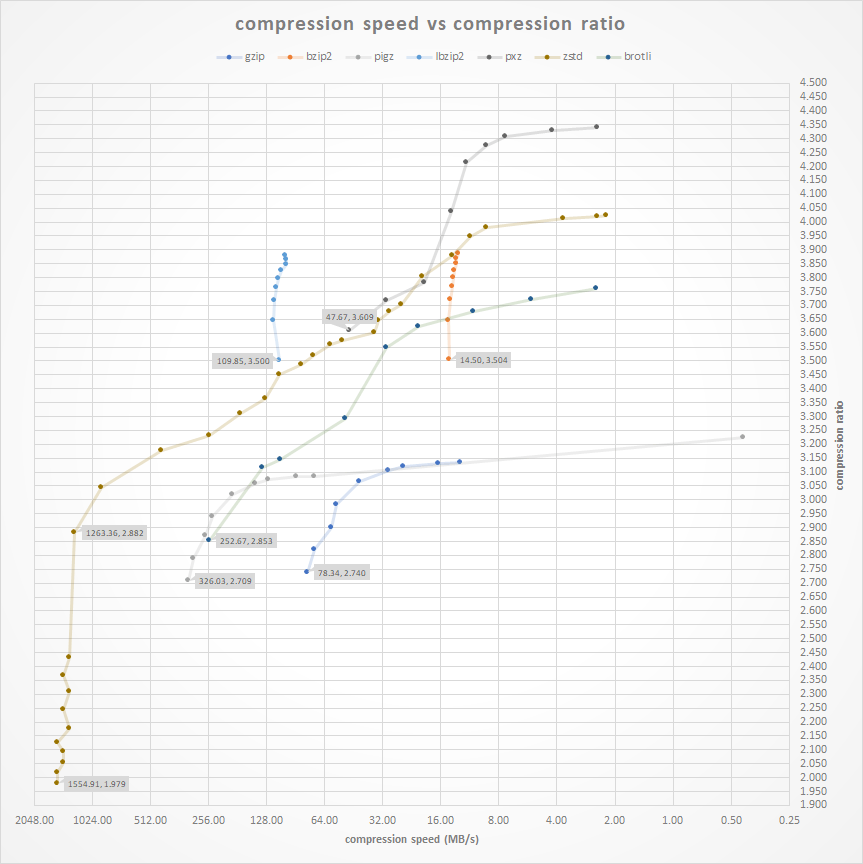

**Updated: Sep 27, 2021**

Recently, I started running out of storage space. Most of the time, this isn't a problem, as I can just delete big files I don't need. But this time, the entire drive is precious, and I can't just buy a new one, at least right now.

And that led me to a sinkhole of compression. Turns out zip's, <abbr title="Why do people even use winrar when 7zip exists?">rar's,</abbr> jpegs, and .mp4's are far from being the best at anything...

## Compression Algorithms

As for compression algorithms, there are a lot, but each made for a specific purpose. 
I'll be showing the most modern ones -- and consequently the best ones. As well as some niche exotic types.

### General Compression
- [ZSTD](https://engineering.fb.com/2016/08/31/core-data/smaller-and-faster-data-compression-with-zstandard/) 
- [XZ](https://en.wikipedia.org/wiki/XZ_Utils)
- [PAQPX](https://github.com/hxim/paq8px) 

### Image Compression
- [JPEG](https://en.wikipedia.org/wiki/JPEG)
- [WebP](https://developers.google.com/speed/webp)
- [AVIF](https://en.wikipedia.org/wiki/AV1#AV1_Image_File_Format_(AVIF))

### Video Compression
- [H.264](https://en.wikipedia.org/wiki/Advanced_Video_Coding)
- [H.265](https://en.wikipedia.org/wiki/High_Efficiency_Video_Coding)
- [H.266](https://en.wikipedia.org/wiki/Versatile_Video_Coding)
- [AV1](https://en.wikipedia.org/wiki/AV1)
---
## Images
You can compress an image even further than it already is, without losing much, or any quality. Ever heard of [WebP?](https://en.wikipedia.org/wiki/WebP) or maybe [AIFF?](https://aomediacodec.github.io/av1-avif/) or, uh, [JPEG?](https://en.wikipedia.org/wiki/JPEG)

**WebP**
```yml
cwebp -q 85 -m 6 image.jpg -o image.webp
```
**Note:** The command above does not consider the original image's "quality"; it wouldn't make sense to convert a 40 quality JPEG into an 85 quality WebP, but you can use this command to find out.

```yml
identify -format '%Q' image.png
```

You can also check out the official [documentation](https://developers.google.com/speed/webp/docs/cwebp) to understand what each command does

**JPEG**

Does it really need an explanation? OK, JPEG is a commonly used method of lossy compression for digital images. Oh, and you also can't have transparency. And has compression artifacts so bad you see it in memes.
```yml
ffmpeg -i image.png image.jpg
```

or

```yml
mogrify -format jpg image.png
```

**AVIF**

AVIF is really new, like [REALLY](https://jakearchibald.com/2020/avif-has-landed/) new. it took me 10 minutes just to find the ["documentation"](https://web.dev/compress-images-avif/), but the results are really impressive. And im not even gonna pretend i know how it works, it's ~magik

```yml
avifenc image.png image.avif 
```

### Testing
If you're wondering, I did not "normalize" any of the base images, nor did I take into account the different settings of different algorithms. The settings I used are listed above, as those, I found to produce the smallest size without sacrificing quality.

#### VIVY PNG Image


**PNG 1.8MB**


**JPG 105K.1B**


**WEBP 66.7KB**


**AVIF 33.7KB**

---


**PNG 358.9KB**


**JPG 32.2KB**


**WEBP 21.3KB**


**AVIF 13.1KB**

#### ANDR JPG IMAGE

[Artwork By とどお](https://www.pixiv.net/en/artworks/92531621)


**JPEG 1.9MB**


**WEBP 151.8KB**


**AVIF 97.8KB**

---



**JPEG 42.6KB**



**WEBP 5.2KB**



**AVIF 4.7KB**

---

## Music
Generally, music can not be reasonably compressed as most music files are already lossy, meaning they lose some data in the process of compression. The only real option would be to use AAC, at a slighly lower bitrate. But if you like high-quality audio, sadly, there's no other option.

```yml
ffmpeg -i input.mp3 -c:a libfdk_aac output.m4a
```

```yml
ffmpeg -i input.mp3 -c:a libfdk_aac -vbr 4 output.m4a
```


## Video

**NOTE:** All video compression artifacts will be re-encoded which will hurt compression ratio and quality.

There are a few next gen formats, [H.265](https://en.wikipedia.org/wiki/High_Efficiency_Video_Coding) [h.266 (yes it is real)](https://en.wikipedia.org/wiki/Versatile_Video_Coding) and [AV1](https://en.wikipedia.org/wiki/AV1) Although due to [licensing issues](https://www.eenewseurope.com/news/industry-split-over-h266-vvc-video-codec-licensing), h.266 isn't realy implemented in anything, not even ffmpeg (yet), but h.265 and AV1 is!

**H.266 Encoding**

H.266 outperforms HEVC by [about %50](https://www.winxdvd.com/video-converter/h266-vvc-vs-av1.htm), although sadly, there's no easy way of using it yet. But the [encoder/decoder is already available](https://github.com/fraunhoferhhi/vvenc)


**AV1 Encoding**

AV1 produces around [%30 better results](https://www.androidauthority.com/av1-codec-1113318/) than H.265

```yml
ffmpeg -i input.mp4 -c:v libsvtav1 -b:v 0 av1_test.mkv
```
**H.265 Encoding**

```yml
ffmpeg -i input.mp4 -c:v libx265 -c:a copy output.mp4
```
to convert audio too
```yml
ffmpeg -i input.mp4 -c:v libx265 -c:a aac(or libfdk_aac) output.mp4
```

### Testing

Credit: Listen To Time Again


H.264 (40.8MB)

H.265 (20MB)

H.264

H.265

## Already Compressed Data
it is MUCH better to first unpack the file and then recompress it with a better algorithm to achieve the best results.
It is what most game repackers (not condoning piracy) usually do, one of those tools is called [precomop](https://github.com/schnaader/precomp-cpp)


## General Data

**Note:** The [chart](https://community.centminmod.com/threads/round-4-compression-comparison-benchmarks-zstd-vs-brotli-vs-pigz-vs-bzip2-vs-xz-etc.18669/) is a little out of date and doesn't account for dictionary compression, etc.

Ideally, compressing general data, like txt's, documents, photos, or anything, should be done using different algorithms, settings, and "extra steps" for each file, but there's no easy way to do that. Maybe il make a program eventually...

**Note:** Most modern lossless compressors aren't archivers. They aren't meant to pack multiple files, although you can do that with tar.
```yml
tar -cf - . | [COMPRESSER AND ARGUMENTS HERE] - > foo.tar.[extension]
```
Ex.
```yml
tar -cf - . | xz -9e -c --threads=0 - > foo.tar.xz
```
Also, it is much better to compress files individually instead of archiving them, that way you won't have to unpack the whole file to view that one folder


### ZSTD
You can't go wrong with zstd, it's the fastest modern algorithm with pleasant compression ratios and very impressive decompression times.

Its notable feature is that it is "real-time," meaning it can decompress quicker than any other currently available method with the same or worse compression ratio.

The sweet spot for zstd compression level is around 6-8, after which it becomes diminishing returns
```yml
zstd --rm -10 -T0 -r *
```
- --rm = Remove original file after compression
- -10 = Compression Level
- -r = Recursive
- -* = All files in current directory

If you are archiving data, meaning you don't need frequent and constant access to it, you can set the compression level to 19 (which is the highest it can go without the –ultra tag.) Although zstd isn't meant to be for ultra compression, go with XZ instead. But you can still try:
```yml
zstd --rm -19 -r *
```

### XZ
XZ is [30 years old](https://en.wikipedia.org/wiki/XZ_Utils) at this point, and yet, it still has better compression ratios than zstd, at the cost of being slower to compress/decompress. Xz is based on the [LZMA algorithm](https://en.wikipedia.org/wiki/Lempel%E2%80%93Ziv%E2%80%93Markov_chain_algorithm)
```yml
xz -9 --threads=0 *
```
- 1-9 = Compression Level
- --threads=0 = Use all core's for compression
- -* = All files in current directory

### PAQ Family

The [PAQ family](https://en.wikipedia.org/wiki/PAQ) was designed to be the best compression algorithm to ever exist, at the expense of everything else. It is quite impractical, but fascinating nonetheless. It can achieve a compression ratio of around 100:1 (meaning it is 100x smaller than the original) The algorithm il use to demonstrate will be PAQ8O
```yml
paq8o -12 file
```
- -12 = Compression Level
- -* = All files in current directory


Extracted XML File Generated By Ableton:
- **Original:** 1.5MB
- **Compressed:** 18.1KB
- **Time:** 55.56s
- **Ratio:** 84:1 !

Compared To:
- **ZSTD:** 40KB
- **GZIP:** 70KB


## The Winners
You could've just skipped here, anyway.
The winners go as follows

### Short Version

- General: ZSTD
- Image: AVIF
- Video: H.265

### Long Version

#### General Compression

Best Overall

```
zstd --rm -10 -T0 file
```
Better Ratio

```
xz -9 --threads=0 file
```
Best Ratio

```
xz -9e --threads=0 file
```

#### Image Compression

Best Overall
```
cwebp -q 85 -m 6 image.png -o image.webp
```
Best Ratio
```
avifenc image.png image.avif 
```

#### Video Compression

Best Overall
```yml
ffmpeg -i input.mp4 -c:v libx264 -c:a copy output.mp4
```

Best Quality/Ratio
```yml
ffmpeg -i input.mp4 -c:v libx265 -c:a copy output.mp4
```

Best Ratio

```yml
ffmpeg -i input.mp4 -c:v libsvtav1 -b:v 0 av1_test.mkv
```


---


## To Do:
- Test H.266
- Better Testing
- Dictionary Compression
- Provide More Information On Algorithms
- Make a Universal Comp Script


