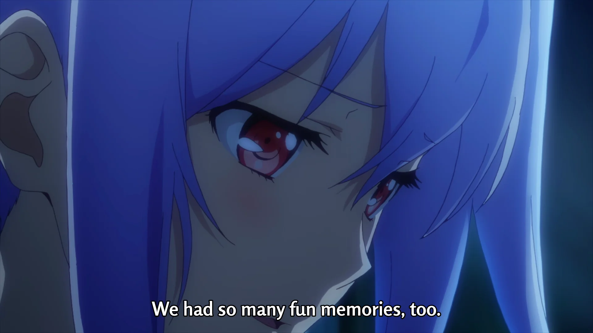

Aira (アイラ) is a character from [Plastic Memories](https://plastic-memories.fandom.com/wiki/Isla), which I thought was named Isla, but turns out that was just a bad translation. It was one of the first animes I ever watched and has gifted me feelings for life. It has shaped much of who I am today, and without it, I would be almost unrecognisable -- which is an understatment.

